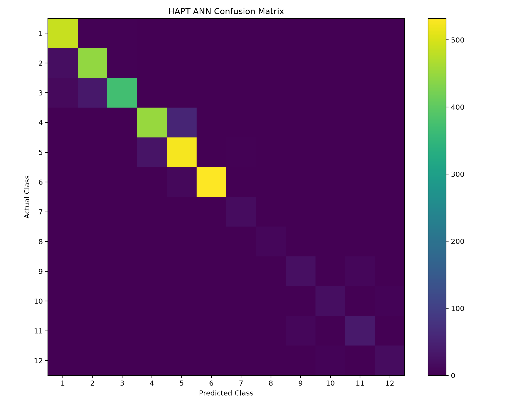
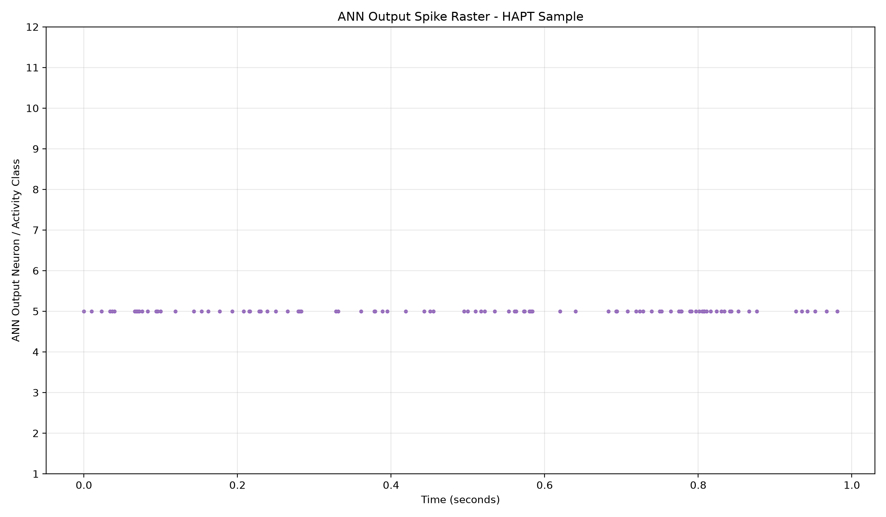
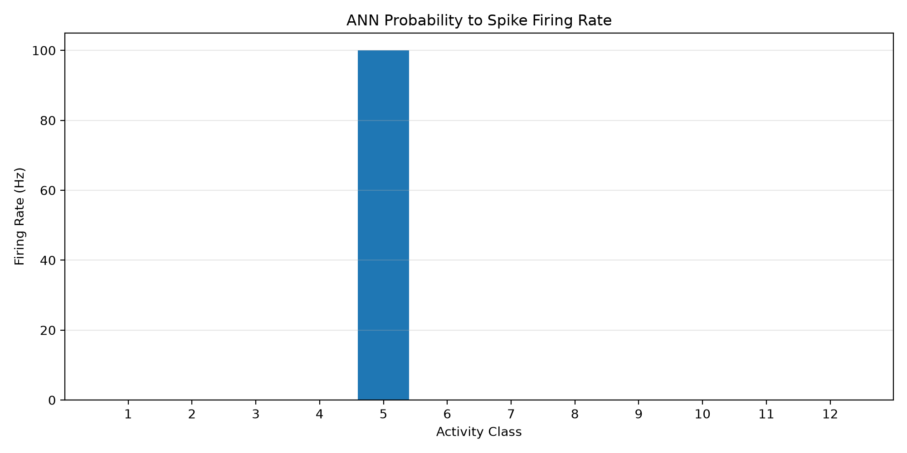
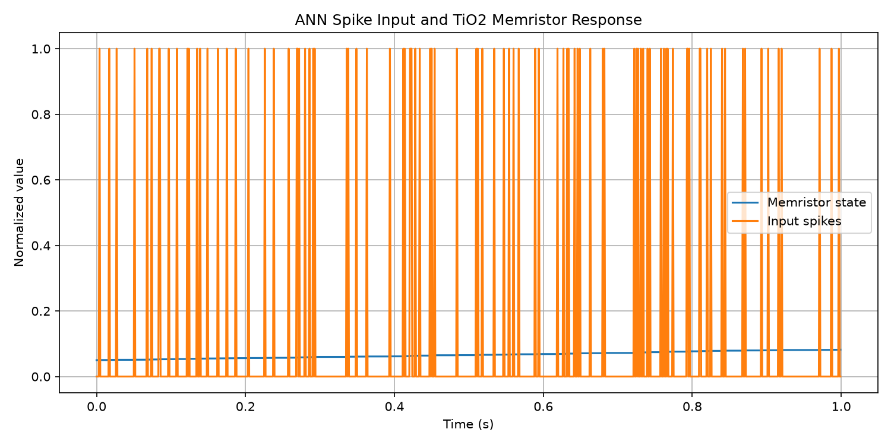

# Brain-Inspired Robotic Control System

A brain-inspired robotic control system combining a real-world HAPT dataset, Artificial Neural Network (ANN), spike-based encoding, TiO2 memristor modeling, ROS 2, and Gazebo simulation.

## Overview

This project processes real-world human activity sensor data, recognizes activities using an ANN, converts the prediction into spike signals, models the response using a TiO2 memristor, and generates robotic movement commands through ROS 2.

## System Architecture

**HAPT Dataset → Preprocessing → ANN → Spike Encoder → TiO2 Memristor → ROS 2 Controller → Gazebo Robot**

## Dataset

The project uses the UCI Human Activity and Postural Transition (HAPT) dataset.

- 561 input features
- 12 activity and postural-transition classes
- 10,929 total samples
- Real-world smartphone accelerometer and gyroscope data

Classes include WALKING, WALKING_UPSTAIRS, WALKING_DOWNSTAIRS, SITTING, STANDING, LAYING, and postural transitions.

## ANN Model

The trained ANN uses the following architecture:

**561 → 128 → 64 → 12**

- Hidden activation: ReLU
- Optimizer: Adam
- Loss: Cross Entropy
- Test accuracy: **92.76%**
- Training iterations: 27
- Trained ANN weights exported to `models/ann_weights.npz`



## Spike Encoding

The ANN prediction is converted into rate-based Poisson spike trains. The dominant activity class determines the firing rate supplied to the memristor model.





## TiO2 Memristor Model

A mathematical TiO2 memristor model is used to simulate state-dependent conductance and current response to spike inputs.

Example simulation results:

- Initial state: 0.050000
- Final state: 0.081946
- Initial conductance: 0.00005950 S
- Final conductance: 0.00009113 S
- Maximum current: 0.00004556 A
- Number of spikes: 95



## ROS 2 and Gazebo

The brain controller is implemented as a ROS 2 Python node and publishes activity recognition, spike rate, memristor state, memristor current, and robot velocity commands.

The controller is connected to a Gazebo differential-drive robot through ROS 2 topic remapping.

### Main Topics

- `/brain/activity`
- `/brain/activity_id`
- `/brain/spike_rate`
- `/brain/memristor_state`
- `/brain/memristor_current`
- `/model/vehicle_blue/cmd_vel`
- `/model/vehicle_blue/odometry`

## Project Structure

```text
brain_robot_controller/
├── brain_robot_controller/
│   ├── preprocess_hapt.py
│   ├── train_ann.py
│   ├── spike_encoder.py
│   ├── tio2_memristor.py
│   └── brain_controller_node.py
├── data/processed/
├── models/
├── plots/
├── launch/
├── package.xml
├── setup.py
└── README.md
